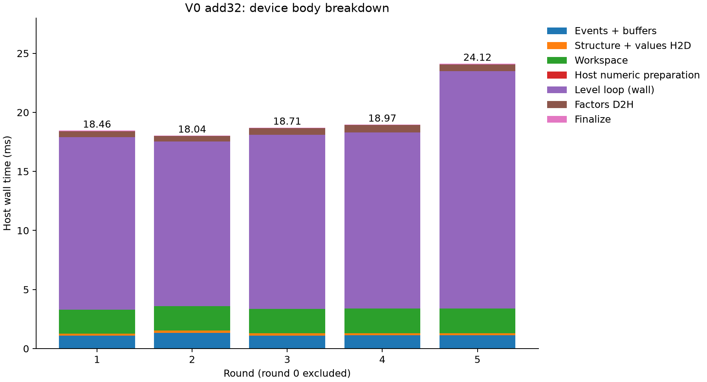
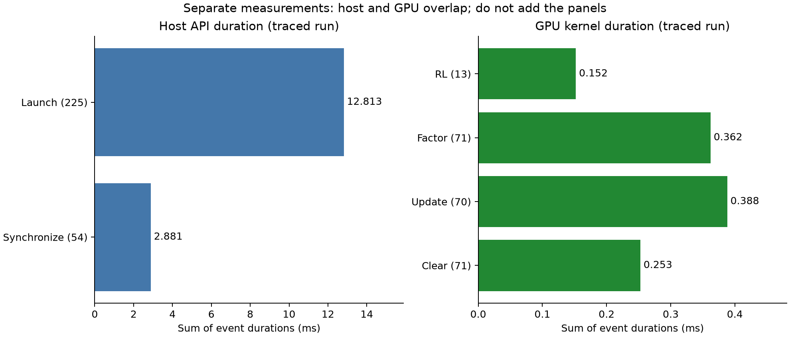
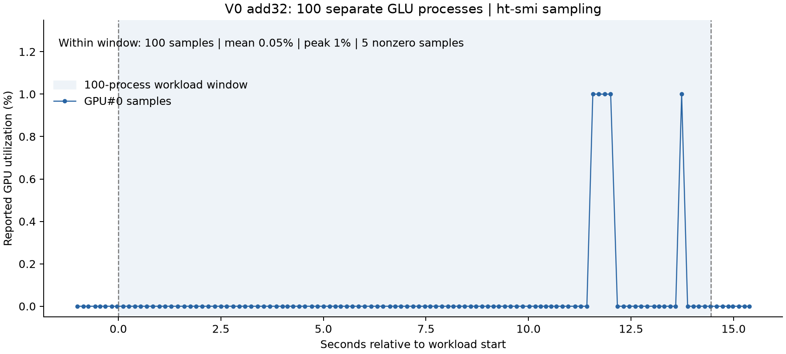

# V0 add32 测量检查点

本检查点记录原算法添加分项计时后的结果，尚未进入 V1。测试矩阵 add32：4960 行，原始非零元 23884。CPU 参考为 KLU_standalone。记录日期：2026-09-30。

## 1. 普通运行计时

来源：`../add32-repeat-QgXGn4/`。round 0 按预定规则排除，round 1–5 全部保留；每轮分别启动 KLU、GLU 新进程。五轮分别计算中位数。

| 指标 | 中位数（ms） |
| --- | ---: |
| KLU 总墙钟时间 | 10.509014 |
| GLU 总墙钟时间 | 77.757242 |
| GLU device_prepare | 47.175406 |
| GLU device_body_mixed | 18.712827 |
| GLU device_release | 0.918744 |
| GLU device_levels_wall | 14.732579 |

冷启动总时间比 KLU/GLU = 0.1351516×。这不是比赛加权加速比。各分项中位数不一定能相加得到总时间中位数；逐轮八个主体分项与主体总时间核对一致。六轮正确性全部 PASS。

## 2. hcTracer 独立诊断

来源：`../add32-trace-SzUJoU/`。追踪退出码 0；相对 L2 误差 2.66658899896347384e-15。

| 事件 | 次数 | 累计耗时（ms） |
| --- | ---: | ---: |
| CPU hcLaunchKernel | 225 | 12.813488 |
| CPU hcDeviceSynchronize | 54 | 2.881194 |
| GPU 计算 kernel | 225 | 1.154816 |

GPU kernel：RL 13 次、0.152064 ms；factor 71 次、0.361984 ms；update 70 次、0.388096 ms；clear 71 次、0.252672 ms。CPU API 与 GPU 执行有重叠，不能相加。JSON 时间单位根据 epoch 数量级和墙钟计时交叉检查按纳秒解释。追踪入口外层耗时约 3.05 秒，追踪显著改变运行开销；追踪数据只作诊断，不替换正式时间，也不直接推算优化加速比。

## 3. ht-smi 利用率

来源：`../add32-util-load-SXnqQA/`。命令：`ht-smi -l 100 -o util.csv --show-usage`，ht-smi 2.2.12。连续启动 100 个 GLU 进程；监控前后各留约 1 秒，正确性比较在监控结束后执行。

负载窗口为服务器本地时间 15:11:39.865669–15:11:54.315173，共 14.449504 秒。此窗口包括进程初始化、求解、输出和进程之间的间隙，不是进程内复用实验。

| GPU#0 指标 | 结果 |
| --- | ---: |
| 窗口内采样点 | 100 |
| 采样算术均值（保留零值） | 0.05% |
| 采样峰值 | 1% |
| 非零样本 | 5/100（5%） |
| 全采样区间间隔中位数 | 145.022 ms |
| 全采样区间间隔范围 | 105.654–164.612 ms |
| 正确性 | 100/100 PASS |
| 最大相对 L2 误差 | 2.7443473321103818e-15 |

其他三张卡在各自负载窗口内的记录均为零。采样均值不是按时间加权的积分均值，非零样本比例不是 GPU 忙碌时间比例。原始读数以整数百分比输出，短任务与监控更新窗口限制了分辨率；不能把 0.05% 解读为 kernel 内部利用率或计算资源占用率。

时间戳解析说明：此 CSV 小数点后的字段按“整数微秒”解释，例如 `.9458` 解释为 9458 微秒（0.009458 秒）。这是基于记录推断的格式：常规小数秒解析会造成同一设备时间倒退，而该解释使四张卡的全部记录严格递增且间隔合理。原 CSV 保留不变，未使用排序来掩盖倒退。

## 4. 当前结论及未完成项

add32 下观察到短 kernel、多次提交与同步、较低的监控采样利用率。可据此选择后续实验方向，但仍需在正常运行中验证每项优化收益，并扩展到其他矩阵。

比赛公式为 T = 0.005 × T_once + T_iter。结构预处理、数值预处理和设备资源生命周期仍有混合区间；当前程序也没有证明结构与设备资源可以在进程内复用。本检查点不填报加权成绩，不把整个 device_prepare 或混合预处理直接按一次性折算。后续需要明确并验证一次性/迭代边界。

所有 GPU 数学修改继续由用户手动进行。当前保存的是测量检查点；V1 还未开始。

## 5. 复现分析

此目录放在服务器仓库的 `experiments/v0/v0-measurement-report/`，保持三个来源目录为同级目录。Python 3 标准库可执行 `python3 analyze_util.py` 验证统计；绘图脚本需要 matplotlib，`python3 analyze_util.py --plot`、`python3 analyze_body.py`、`python3 analyze_trace.py` 分别重建三张图。分析不修改原始日志。
