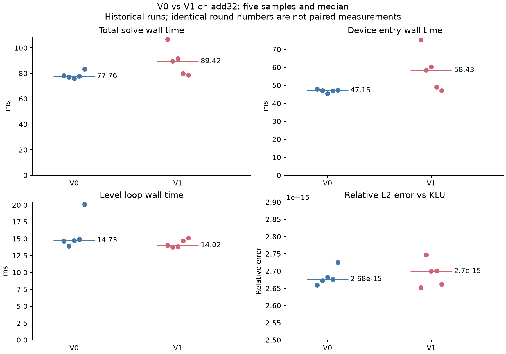
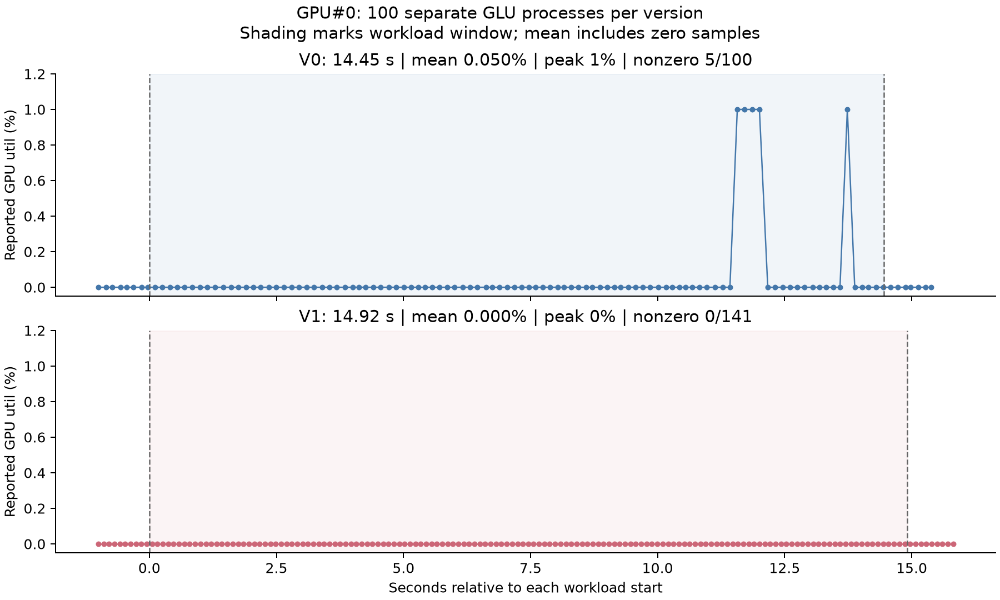

# V1：按设备 wave 宽度分组

基线提交：`2a52f8d`。设备查询结果：waveSize=64，maxThreadsPerBlock=1024。日期：2026-09-30。

## 改动及实验边界

RL 和 RL_perturb 的组编号、组内编号、元素步长与列批次步长由硬编码 32 改为设备端 waveSize。批量启动接口改为传入线程数，共享内存按 threads_per_block / deviceProp.waveSize 分配。三个分支仍分别使用 64、128、1024 个线程。原来的单列 kernel、同步策略及数值运算保持不变。新增设备参数输出。

仅验证 add32（4960 行、23884 原始非零元）默认非扰动路径。RL_perturb 的代码虽已同步修改，但本实验没有运行 -p 路径，不能声称该路径或所有矩阵均已验证。

## 时间与误差

V0 来源：`../../v0/add32-repeat-QgXGn4/`。V1 来源：`../add32-repeat-A3F35u/`。各版 round 0 按预定规则排除，正式 round 1–5 全部保留。每轮重新启动 KLU_standalone 与 GLU。两个版本不是交替执行的配对实验。

| 指标 | V0 | V1 |
| --- | ---: | ---: |
| KLU 总时间中位数（ms） | 10.509014 | 10.459961 |
| GLU 总时间中位数（ms） | 77.757242 | 89.424110 |
| device_count_entry 中位数（ms） | 47.149214 | 58.431283 |
| device_body_mixed 中位数（ms） | 18.712827 | 19.141438 |
| device_levels_wall 中位数（ms） | 14.732579 | 14.023050 |
| KLU/GLU 总时间中位数之比 | 0.135152× | 0.116970× |

V1 六轮正确性全部 PASS；最大相对 L2 误差 2.74734864897518864e-15。循环时间中位数下降 4.816%，总时间中位数上升 15.004%。设备入口存在明显差异与波动，历史五轮样本不足以将变化归因于代码改动，因此不声称获得稳定加速。不同分项的中位数不一定可加和。



首次 V1 冒烟运行总时间 464.676577 ms，循环时间 387.985487 ms，相对误差 2.71751199372269683e-15，PASS。它是独立冒烟测试，不属于随后预定的六轮计时批次；原因尚未确认。

## GPU 利用率

V0 来源：`../../v0/add32-util-load-SXnqQA/`。V1 来源：`../add32-util-load-hHXvh0/`。命令均为 ht-smi -l 100 -o util.csv --show-usage。每版连续启动 100 个独立 GLU 进程，比较解在监控结束后执行。本实验没有运行 hcTracer。

| GPU#0 指标 | V0 | V1 |
| --- | ---: | ---: |
| 负载窗口（s） | 14.449504 | 14.915752 |
| 窗口内采样点 | 100 | 141 |
| 包含零值的采样算术均值 | 0.05% | 0% |
| 采样峰值 | 1% | 0% |
| 非零样本比例 | 5% | 0% |
| 全采样区间间隔中位数（ms） | 145.022 | 105.724 |
| 正确性检查 | 100/100 PASS | 100/100 PASS |
| 最大相对 L2 误差 | 2.7443473321103818e-15 | 2.7487070565081374e-15 |

V1 窗口：服务器本地时间 15:43:37.890095–15:43:52.805847；其他三张卡在各自窗口内的读数也全部为零。该窗口包含初始化、输出与进程间隙。原始利用率读数为整数百分比；窗口内全零不证明 GPU 未执行任务，也不证明 V1 效率提升或下降。没有将采样比例解释为 GPU 忙碌时间比例、SM/AP occupancy 或 kernel 内部利用率。相同 -l 参数下实际采样间隔不同，图使用真实记录时间。

与 V0 一致，时间戳小数点后的数字按整数微秒解析（例如 .9458 表示 9458 微秒）。这是从日志推断的格式，解析后四张卡记录全部严格递增；原 CSV 不变。以 load-start.txt / load-end.txt 的闭区间筛选，均值保留零值，不进行插值或按时间加权。



## 本步结论

V1 完成设备 wave 宽度适配，在 add32 默认路径的已执行测试中通过正确性验证。尚未确认整体性能收益。保留这一版本作为下一步 V2 线程数实验的起点，不将本次结果描述为成功加速。

比赛的 0.005×一次性时间+迭代时间未在本实验中重新定义或计算。使用现有计时点，不新增细分计时。

## 复现图表

本目录放在仓库 experiments/v1/v1-report/。analyze.py 读取上面两批计时日志，生成 comparison.json 与时间/误差图。analyze_util.py 读取两批利用率 CSV 和正确性日志，生成 util_comparison.json；加 --plot 生成利用率图。运行：

```bash
python3 analyze.py
python3 analyze_util.py --plot
```

绘图需要 matplotlib；仅运行 analyze_util.py 的统计部分使用 Python 标准库。原始日志保留在对应的版本目录中。
