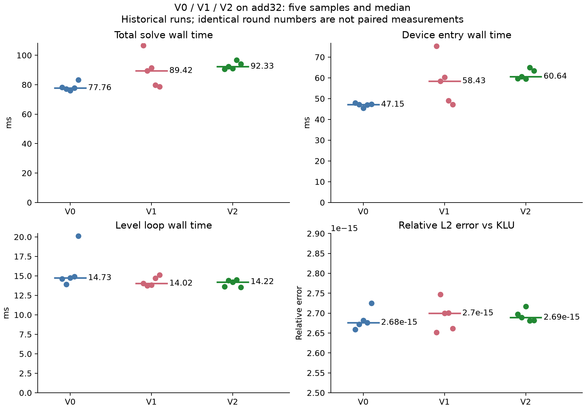
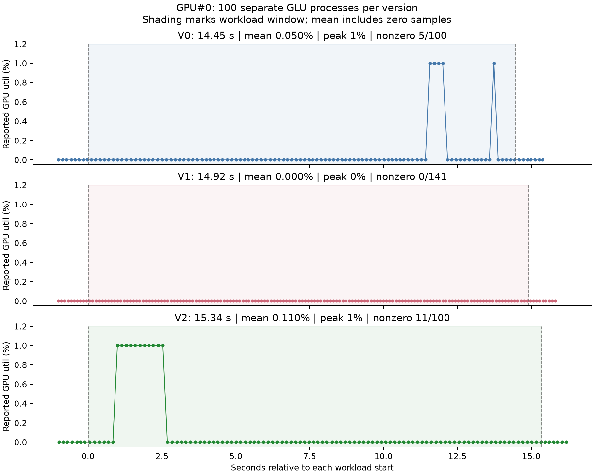

# V2：单列路径使用 4 个 wave

基线：V1 提交 `3188fa8`。日期：2026-09-30。设备 waveSize=64，maxThreadsPerBlock=1024。

## 改动

增加 single_col_waves=4，并计算 single_col_threads=single_col_waves×deviceProp.waveSize。单列 factor、perturb factor、update、clear 四处启动由固定 1024 线程改为 256 线程。批量路径、kernel 运算、循环步长和同步策略保持不变。本实验只测试了 4-wave 配置，不是自适应线程数算法，也没有证明该配置最优。

仅验证 add32 默认非扰动路径（4960 行，原始非零元 23884）。不能将结论扩展为所有矩阵或 -p 路径均已通过。

## 普通计时实验

来源：V0 `../../v0/add32-repeat-QgXGn4/`，V1 `../../v1/add32-repeat-A3F35u/`，V2 `../add32-repeat-lWale1/`。每版排除预定 round 0，保留正式 round 1–5，包括 V2 第 2 轮较慢的 KLU 样本。各版本在不同时段运行，并非交替配对测试。每轮为独立进程。

| 中位数指标 | V0 | V1 | V2 |
| --- | ---: | ---: | ---: |
| KLU 总时间（ms） | 10.509014 | 10.459961 | 10.489343 |
| GLU 总时间（ms） | 77.757242 | 89.424110 | 92.330273 |
| 设备入口（ms） | 47.149214 | 58.431283 | 60.637498 |
| device_body_mixed（ms） | 18.712827 | 19.141438 | 19.555297 |
| device_levels_wall（ms） | 14.732579 | 14.023050 | 14.222214 |
| KLU/GLU 总时间中位数之比 | 0.135152× | 0.116970× | 0.113607× |

V2 六轮全部 PASS，最大相对 L2 误差 2.72191372597414955e-15。V2 比 V1 总时间中位数高 3.250%，循环时间中位数高 1.420%。样本有明显重叠，入口时间也有差异，不能将这些变化直接归因于线程数修改。未确认稳定性能收益。

独立冒烟运行来源：`../add32-smoke-DPSbe8/`。总时间 102.734640 ms，逐层循环 14.296590 ms，相对误差 2.64577194156856357e-15，最终独立执行的解比较 PASS。冒烟数据不属于正式六轮计时批次。

## GPU 利用率实验

命令：ht-smi -l 100 -o util.csv --show-usage。连续启动 100 个 GLU 进程，监控结束后比较解；无 hcTracer。来源：V0 `../../v0/add32-util-load-SXnqQA/`，V1 `../../v1/add32-util-load-hHXvh0/`，V2 `../add32-util-load-BMyNGn/`。

| GPU#0 指标 | V0 | V1 | V2 |
| --- | ---: | ---: | ---: |
| 负载窗口（s） | 14.449504 | 14.915752 | 15.344526 |
| 窗口内样本数 | 100 | 141 | 100 |
| 采样算术均值，含零值 | 0.05% | 0% | 0.11% |
| 采样峰值 | 1% | 0% | 1% |
| 非零样本数 | 5 | 0 | 11 |
| 全采样区间间隔中位数（ms） | 145.022 | 105.724 | 152.3745 |
| 正确性检查 | 100/100 PASS | 100/100 PASS | 100/100 PASS |

V2 窗口：服务器本地时间 15:53:10.851024–15:53:26.195550。最大相对 L2 误差 2.7565232835364002e-15。其他三张卡在对应窗口内读数均为零。

时间戳沿用前两版的解析假设：小数点后的字段为整数微秒，例如 .9458 解释为 9458 微秒；四张卡全部记录解析后严格递增。保留原 CSV，按 load-start.txt 到 load-end.txt 闭区间统计，不删零值，不插值，不将算术均值称作时间加权均值。

窗口包含初始化、输出和进程间隙。读数以整数百分比记录，实际采样间隔也不同；0.11% 大于 0% 并不能证明计算资源利用改善或性能加速。非零样本比例不等于 GPU 忙碌时间比例，也不是 occupancy。当前利用率测量只作为该工作负载下的监控记录。

## 结论与下一步

单列路径从 1024 线程改为 256 线程后，在已执行的 add32 默认路径测试中正确性保持，尚未观察到稳定加速。保存为 V2 实验检查点，而不是最优配置。后续按计划检查 V3 共享内存和线程分组的正确性问题，修改前先说明具体数据依赖。

沿用现有计时点；不新增计时节点，不填报尚未明确边界的 0.005×一次性时间+迭代时间成绩。

## 复现图表

将此报告目录放在 experiments/v2/v2-report/，保持上述原始数据目录。Python 3 执行 `python3 analyze.py` 重建时间/误差图，执行 `python3 analyze_util.py --plot` 重建利用率图。绘图需要 matplotlib；仅执行 analyze_util.py 的统计部分使用标准库。输出 comparison.json、util_comparison.json 和 PNG/SVG 图表。
